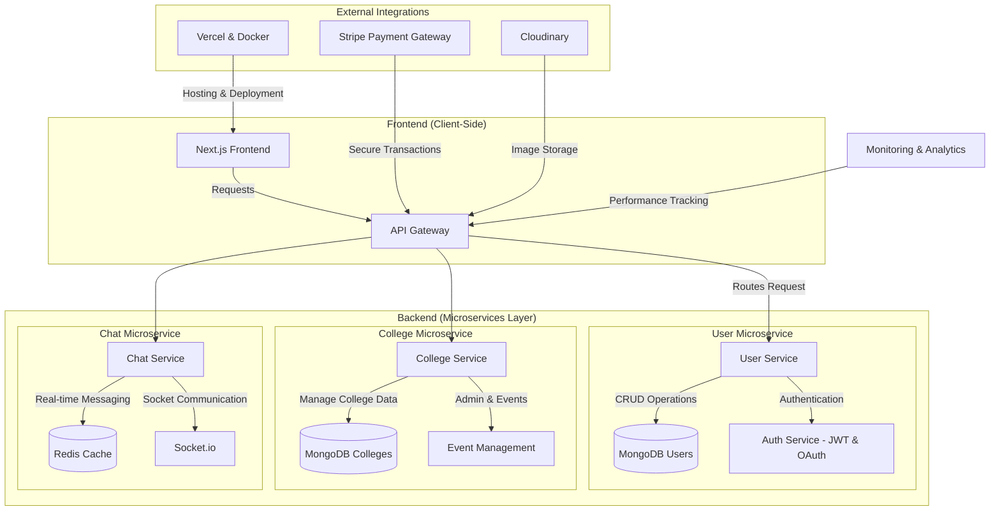
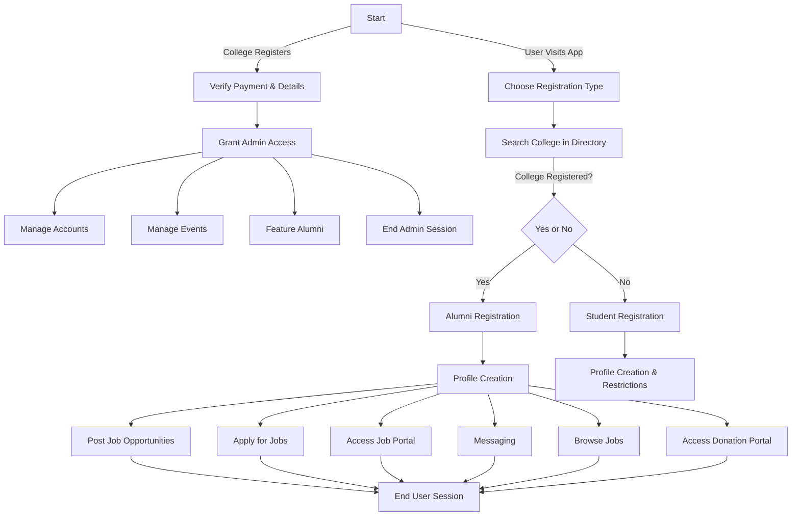

# 🎓 LinkLum – College Alumni Registration & Admin Management System

Welcome to the **LinkLum**, a web platform designed to connect alumni with their college, fostering a vibrant and engaged alumni network. This portal allows alumni to register their profiles, stay updated on events, and engage with their alma mater. The admin dashboard enables administrators to easily manage alumni profiles and promote upcoming events.

# 🚀 Key Features

### 📝 Alumni Registration  
- Create & manage **detailed alumni profiles** with career highlights.  
- Organize and participate in **networking events & mentorship programs**.  
- Feature **prominent alumni** to inspire and guide current students.  
- Access **exclusive job postings & donation portals** to contribute to the alma mater.   

### 🏫 Student Registration  
- Register with **controlled access** and permissions.  
- Apply for **internships & job opportunities** within the platform.  
- Engage with **alumni for career guidance & mentorship**.

### 🔐 Admin Access  
- **Manage alumni & student profiles** with approval workflows.  
- Oversee **event management, featured alumni, and platform security**.  
- Maintain an **active job board & donation portal**.  

### 📅 Event Management  
- Colleges can **organize exclusive alumni & student events**.  
- Users can **RSVP, participate, and engage in networking sessions**. 

### 🌟 Featured Alumni  
- Highlight distinguished alumni by displaying their image, name, and current role, providing inspiration and connection to others.  

### 💬 Real-Time Messaging  
- **Verified students & alumni** can connect instantly through **secure messaging**.  
- Encourages **mentorship, career discussions, and networking**.    

###  🎓 Student Hub  
- A dedicated space for students to propose ideas, seek guidance from alumni, and raise concerns related to academics and college life.  

### 🚀 Startup & Project Showcase  
- Students and alumni can showcase their innovative projects, startups, and research work to attract support and collaboration.  

### 📢 Discussion Forums  
- Engage in topic-based discussions where alumni and students can share insights, experiences, and career advice.  

### 📰 Alumni Blog & News  
- A blog section where alumni can share their success stories, industry insights, and important updates about their professional journeys.  

### 🎯 Job & Internship Portal  
- Alumni and companies can post job and internship opportunities exclusively for students and recent graduates.  

### 🤝 Mentorship Program  
- Pair students with experienced alumni mentors to provide career guidance, resume reviews, and professional advice.  

### 📸 Photo & Media Gallery  
A shared gallery for event photos, college memories, and alumni achievements.  

### 📖 Alumni Directory  
- **Advanced search filters**: Find alumni by **year of passing, name, branch, location, and profession**.  
- **Profile browsing**: Gain insights into alumni career paths & achievements.  

### 📊 Analytics & Engagement Reports  
- Admins can track alumni engagement, event participation, and overall platform activity through analytics dashboards.  

# 🛠 Tech Stack

### 🚀 Frontend  
- **Next.js** – Leverages **SSR (Server-Side Rendering)** and **SSG (Static Site Generation)** for enhanced performance and SEO.  
- **Tailwind CSS** – Ensures clean, scalable, and maintainable styling for faster development.  

### 🔥 Backend  
- **Node.js & Express.js** – Implements a **microservices architecture** for scalability and modularity.  

### 💾 Database  
- **MongoDB** – NoSQL database offering **fast read/write operations** and easy scalability compared to traditional SQL databases.  

### 💳 Payment Integration  
- **Razorpay** – Secure and seamless payment gateway integration for handling transactions.  

### ⚡ Real-Time Communication  
- **Socket.io** – Enables **real-time messaging** for instant interactions between users.  

### 🖼️ Image & Media Hosting  
- **Cloudinary** – Optimizes and serves images efficiently for **better performance and reduced load times**.  

### 🏗️ Containerization & Deployment  
- **Docker** – Simplifies containerized deployment, ensuring consistency across environments.  
- **AWS EC2 & AWS Lambda** – Combines **scalable server-based and serverless solutions** for optimized backend performance.  
- **Vercel** – Provides **fast, efficient, and automated frontend deployment** for seamless user experiences.  

### 🎭 Animations & UI Enhancements  
- **GSAP (GreenSock Animation Platform)** – Enables **smooth, high-performance animations**, enhancing user engagement.  

### 🛡️ Performance & Load Testing  
- **k6** – Ensures backend scalability and robustness through **stress, load, and performance testing**.  

## 🏆 Achievements  

- **🚀 100% Performance & Best Practices**  
  - Achieved **perfect Lighthouse scores** in **Performance, Best Practices, and SEO** with a high level of **Accessibility**.  

- **⚡ High Scalability & Load Handling**  
  - Successfully handled **20K+ concurrent users** with optimized performance, tested using **k6 load testing**.  

- **⏳ Ultra-Fast API Response Time**  
  - Leveraged **microservices architecture** to ensure **low-latency responses** and high availability.  
  - Optimized database queries and caching for **sub-millisecond response times**.  

- **🔒 Secure & Reliable Infrastructure**  
  - Implemented **JWT-based authentication** and **role-based access control (RBAC)** for enhanced security.  
  - Adopted **Dockerized microservices** with **AWS EC2 & Lambda** for scalable deployment.  

- **📈 Optimized Frontend for Speed & UX**  
  - Achieved **instant page loads** using **Next.js with SSR & SSG**.  
  - Smooth animations powered by **GSAP**, enhancing user engagement.  

- **📡 Real-Time Communication at Scale**  
  - Implemented **Socket.io** for **seamless real-time messaging** with optimized socket handling.  

- **🛠️ Efficient CI/CD & Deployment**  
  - Automated deployment pipeline using **GitHub Actions & Vercel for frontend**.  
  - Backend services deployed with **Docker, AWS EC2, and Lambda** for reliability.  

## High-Level System Architecture

# User Flow 

## Flowchart Description

1. **Start**: Users begin by visiting the app.
2. **Choose Registration Type**: Users select whether they are registering as an Alumni or a Student.
   - If the college is not registered, it must register first.
3. **Alumni and Student Flows**: 
   - Alumni can access additional features such as managing events, posting job opportunities, and accessing the donation portal.
   - Students have profile restrictions but can access job listings and messaging functionalities.
4. **Admin Section**: Admins manage alumni profiles, accounts, and events.
5. **End Sessions**: Users and admins can end their sessions after completing tasks.

